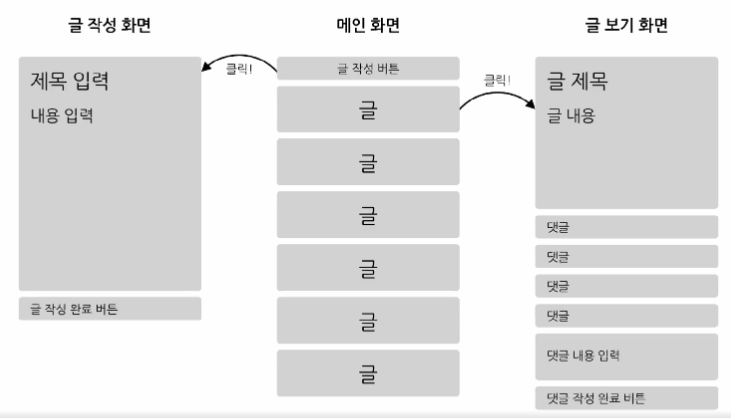
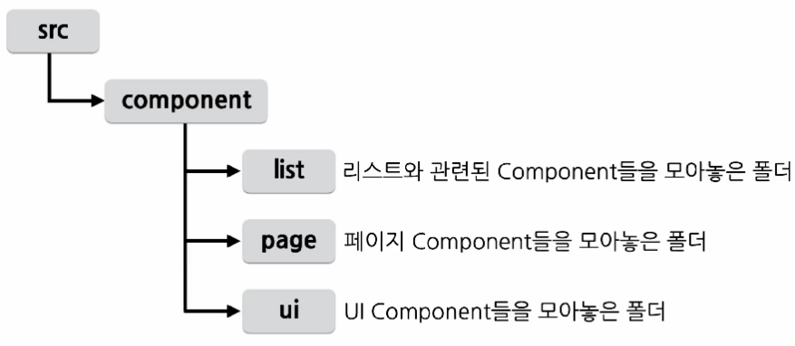

# Chapter 16 : 미니 블로그 프로젝트

## 프로젝트 기획
### 기능
- 글 목록 보기 기능 (리스트 형태)
- 글 보기 기능
- 댓글 보기 기능
- 글 작성 기능
- 댓글 작성 기능

### 화면 구성

### 각 기능에 필요한 Component
|  Function  |           Component           |
|:----------:|:-----------------------------:|
| 글 목록 보기 기능 |    PostList / PostListItem    |
|  글 보기 기능   |             Post              |
|  댓글 보기 기능  | CommentList / CommentListItem |
|  글 작성 기능   |           PostWrite           |
|  댓글 작성 기능  |         CommentWrite          |

### 폴더 구성

## 구현
> Bottom-up 방식으로 작은 부분부터 구현

### UI Component
> 사용자가 입력을 할 수 있게 해주는 Component
 
