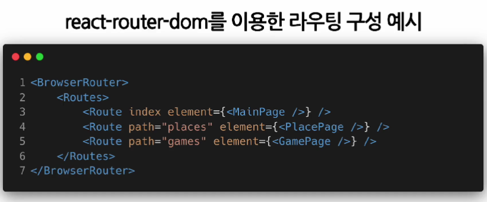

# Chapter 16 : 미니 블로그 프로젝트

## 프로젝트 기획
### 기능
- 글 목록 보기 기능 (리스트 형태)
- 글 보기 기능
- 댓글 보기 기능
- 글 작성 기능
- 댓글 작성 기능

### 화면 구성

### 각 기능에 필요한 Component
|  Function  |           Component           |
|:----------:|:-----------------------------:|
| 글 목록 보기 기능 |    PostList / PostListItem    |
|  글 보기 기능   |             Post              |
|  댓글 보기 기능  | CommentList / CommentListItem |
|  글 작성 기능   |           PostWrite           |
|  댓글 작성 기능  |         CommentWrite          |

### 폴더 구성

## 구현
> Bottom-up 방식으로 작은 부분부터 구현

아주 작은 UI Component부터 구현하여 Page 구현 시 필요한 Component를 조합

### UI Component
> 사용자가 입력을 할 수 있게 해주는 Component

### React-Router-Dom v6
> 페이지별 경로를 Component 형식으로 구성하게 도와주는 리액트의 라이브러리  

구성 예시

  
**Router Component**
- BrowserRouter
  - 브라우저의 경로를 탐색하게끔 도와주는 최상위 컴포넌트
  - 브라우저의 히스토리 등을 이용하여 이전 페이지로 이동하게 도와준다.
- Routes
  - 여러개의 Route 컴포넌트를 children으로 가질 수 있는 컴포넌트
- Route
  - index : 최상위 경로
  - path : api 경로
  - element : 경로가 일치할 경우 응답할 element

**useNavigate()**
- Routing을 도와주는 Hook
- onClick 등을 통한 이벤트 처리에 대한 응답으로 `navigate(path)`를 호출하면, 페이지를 라우팅한다.

## Deployment
### App.js
> 리액트의 최상위 컴포넌트로써, Routing을 설정/적용하는 컴포넌트

### index.js
> 리액트가 기본적으로 렌더링하는 파일로써, 처음으로 렌더링될 컴포넌트를 초기화한다. 

### Build
> 코드와 애플리케이션이 사용하는 이미지, CSS 파일 등의 파일을 모두 모아서 패키징 하는 과정

1. `npm run build`
2. `/build` 디렉토리 생성
3. `npm install -g serve` : 빌드된 static 파일들을 서빙해주는 프로그램 설치
4. `serve -s build` : 빌드 폴더를 기반으로 웹 애플리케이션을 서빙하여 호스팅

> 배포란 빌드를 통해 생성된 정적인 파일들을 `serve`를 이용하여 배포하려는 서버에 올리는 과정